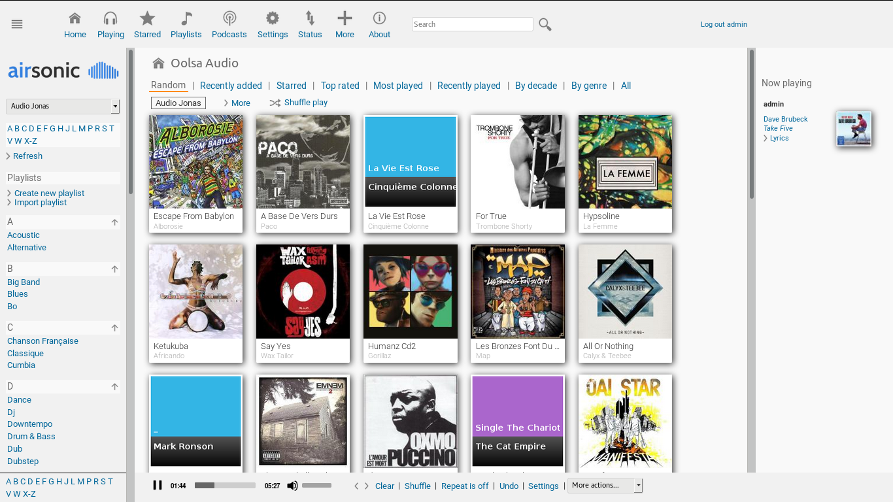

<!--
# README.md
# airsonic/airsonic
-->
Airsonic
========

What is Airsonic?
-----------------

Airsonic is a free, web-based media streamer, providing ubiquitous access to your music. Use it to share your music with friends, or to listen to your own music while at work. You can stream to multiple players simultaneously, for instance to one player in your kitchen and another in your living room.

Airsonic is designed to handle very large music collections (hundreds of gigabytes). Although optimized for MP3 streaming, it works for any audio or video format that can stream over HTTP, for instance AAC and OGG. By using transcoder plug-ins, Airsonic supports on-the-fly conversion and streaming of virtually any audio format, including WMA, FLAC, APE, Musepack, WavPack and Shorten.

If you have constrained bandwidth, you may set an upper limit for the bitrate of the music streams. Airsonic will then automatically resample the music to a suitable bitrate.

In addition to being a streaming media server, Airsonic works very well as a local jukebox. The intuitive web interface, as well as search and index facilities, are optimized for efficient browsing through large media libraries. Airsonic also comes with an integrated Podcast receiver, with many of the same features as you find in iTunes.

Based on Java technology, Airsonic runs on most platforms, including Windows, Mac, Linux and Unix variants.

History
-----

The original [Subsonic](http://www.subsonic.org/) is developed by [Sindre Mehus](mailto:sindre@activeobjects.no). Subsonic was open source through version 6.0-beta1, and closed-source from then onwards.

Libresonic was created and maintained by [Eugene E. Kashpureff Jr](mailto:eugene@kashpureff.org). It originated as an unofficial("Kang") of Subsonic which did not contain the Licensing code checks present in the official builds. With the announcement of Subsonic's closed-source future, a decision was made to make a full fork and rebrand to Libresonic.

Around July 2017, it was discovered that Eugene had different intentions/goals
for the project than some contributors had.  Although the developers were
hesitant to create a fork as it would fracture/confuse the community even
further, it was deemed necessary in order to preserve a community-focused fork.
To reiterate this more clearly:

Airsonic's goal is to provide a full-featured, stable, self-hosted media server
based on the Subsonic codebase that is free, open source, and community driven.

Pull Requests are always welcome. Keep in mind that we strive to balance
stability with new features. As such, all Pull Requests are reviewed before
being merged to ensure we continue to meet our goals.

License
-------

Airsonic is free software and licensed under the [GNU General Public License version 3](http://www.gnu.org/copyleft/gpl.html). The code in this repository (and associated binaries) are free of any "license key" or other restrictions. If you wish to thank the maintainer of this repository, please consider a donation to the [Electronic Frontier Foundation](https://supporters.eff.org/donate).

The [Subsonic source code](https://github.com/airsonic/subsonic-svn) was released under the GPLv3 through version 6.0-beta1. Beginning with 6.0-beta2, source is no longer provided. Binaries of Subsonic are only available under a commercial license. There is a [Subsonic Premium](http://www.subsonic.org/pages/premium.jsp) service which adds functionality not available in Airsonic. Subsonic also offers RPM, Deb, Exe, and other pre-built packages that Airsonic [currently does not](https://github.com/airsonic/airsonic/issues/65).

Usage
-----

Airsonic can be downloaded from
[GitHub](https://github.com/airsonic/airsonic/releases).

Please use the [Airsonic documentation](https://airsonic.github.io/docs/) for instructions on running Airsonic.

Community
---------
We have several places outside of github for community discussion, questions, etc:

- [#airsonic:matrix.org on Matrix](https://matrix.to/#/#airsonic:matrix.org)
- [#airsonic on IRC](http://webchat.freenode.net?channels=%23airsonic)
- [airsonic subreddit](https://www.reddit.com/r/airsonic)

*Note that the Matrix room and IRC channel are bridged together.*
