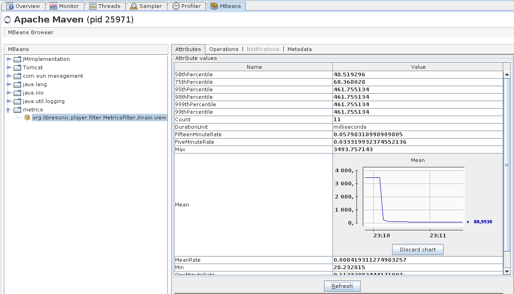

The Libresonic framework contains a convenient class (called MetricsManager) to add inner metrics that constructs in real time some performance indicators.

The use of MetricsManager is illustrated in the org.libresonic.player.filter.MetricsFilter class. 

The MetricsFilter adds a metric based on the time spent by each /main.view HTTP request. This is interesting as the main.view request is invoqued when something is displayed in the main Libresonic web frame.

By default, the MetricsManager is deactivated; it does nothing. 
It can be activated only by adding the following line inside the livresonic.properties configuration file :

```
Metrics=
```

Once the MetricsManager as been activated this way, each metric can be inspected using a jmx console like VisualVM.
Each metric is registered as a MBean as shown below.

