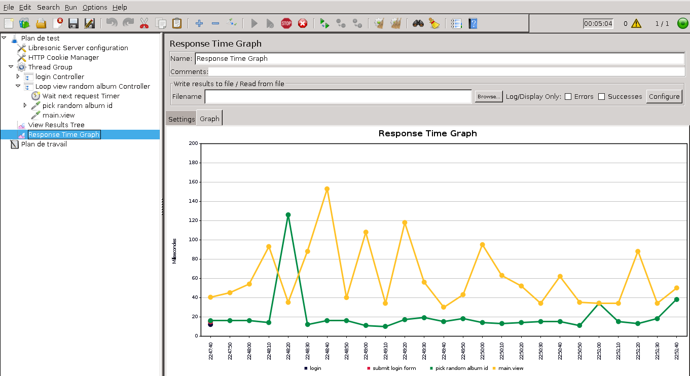

#Performance test using Apache JMeter

This document explains how to run performance tests on Libresonic using [Apache JMeter](http://jmeter.apache.org/). 
The installation and setup of JMeter is not documented bellow; please refer to the JMeter web site.

##Main test plan
The Libresonic sources come with a main performance test case defined in file libresonic-main/src/test/resources/jmeter/libresonicMainTestPlan.jmx.
This is a JMeter test plan file.

This test plan simulates a single user that picks up a random album id (xxx) every 5 second and run the main.view?id=xxx http request. 

To run the test plan, open the libresonicMainTestPlan.jmx file in JMeter.
Run Libresonic. Note that the default configuration of this test plan expects Libresonic to be reached at the http://localhost:8080 URL.
Then run the test plan in JMeter. 
After a while, you'll obtain a beautiful graph like this

If you want to run the test with more than one user, just change the _Number of Threads_ property in the main _Thread Group_ configuration.

If you want to change the delay between each request, change the value in the _Wait next request Timer_ _Constant Timer_ definition. 

